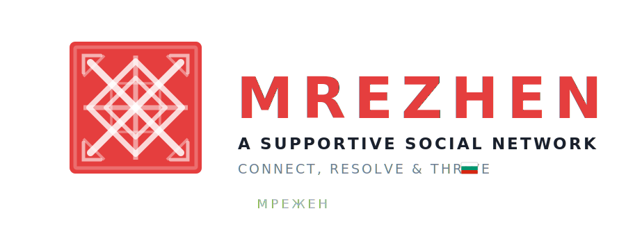

<p align="center">
  
</p>

🌍 **Translate this page:** <a href="https://translate.google.com/translate?sl=auto&tl=bg&u=https://github.com/your-org/Mrezhen" target="_blank">🇧🇬 Български</a>

<!-- TABLE OF CONTENTS -->
<details>
  <summary>Table of Contents</summary>
  <ol>
    <li>
      <a href="#-mrezhen">About The Project</a>
      <ul>
        <li><a href="#-features">Features</a></li>
      </ul>
    </li>
    <li>
      <a href="#-tech-stack">Technology & Tools</a>
      <ul>
        <li><a href="#-tech-stack">Tech Stack</a></li>
        <li><a href="#-software--programs">Software & Programs</a></li>
      </ul>
    </li>

    <li>
      <a href="#%EF%B8%8F-installation">Setup & Usage</a>
      <ul>
        <li><a href="#%EF%B8%8F-installation">Installation</a></li>
        <li><a href="#-documentation">Documentation</a></li>
      </ul>
    </li>
    <li>
      <a href="#-contributors">Community & Support</a>
      <ul>
        <li><a href="#-contributors">Contributors</a></li>
        <li><a href="#contact">Contact Us</a></li>
      </ul>
    </li>
  </ol>
</details>

# 🧠 Mrezhen

Mrezhen is a supportive social media platform that connects individuals facing similar life challenges. It goes beyond passive communication by integrating an **AI companion** that guides users through personal struggles, transforming difficulties into achievable goals through quests, milestones, and peer-to-peer support. Our mission is to turn isolation into collaboration, making shared experience a catalyst for **positive change**.

<p align="center">
  
</p>

<p align="center">
    
    
    
    
    
    
<p>

## ✨ Features

<details open="true">
  <summary><b>🤖 AI Companion & Guidance</b></summary>
    <ul>
      <li>🧭 <b>AI Chat Companion</b>: An integrated AI chatbot (powered by Groq & Google Gemini) provides personalized feedback, actionable advice, and tailored suggestions based on your unique profile and struggles.</li>
      <li>🎯 <b>Quests & Milestones</b>: The AI issues small, actionable <b>Quests</b> and larger <b>Milestones</b> relevant to your specific challenges — turning problems into step-by-step plans.</li>
      <li>📸 <b>Proof-of-Completion</b>: Verify quest completion by uploading image or video proof, which is then analyzed by AI to ensure authenticity.</li>
      <li>🔗 <b>Smart Matching</b>: Get tailored suggestions for connecting with other users based on high-similarity profiles, facilitating meaningful peer relationships.</li>
    </ul>
</details>

<details>
  <summary><b>🎮 Gamification & Battles</b></summary>
  <ul>
    <li>⭐ <b>Point & XP System</b>: Earn points for completing quests, tasks, and milestones — track your level progression and weekly XP gains.</li>
    <li>⚔️ <b>1v1 Battle System</b>: Challenge other users to 7-day battles where you compete on milestone progress with daily quests, proof submissions, and peer verification.</li>
    <li>📊 <b>Activity Tracking</b>: Monitor your progress with detailed activity logs, progress bars, and interactive dashboards.</li>
    <li>🏆 <b>Leaderboards & Levels</b>: Rise through levels as you accumulate XP and complete challenges.</li>
  </ul>
</details>

<details>
  <summary><b>💬 Social & Community</b></summary>
  <ul>
    <li>👥 <b>Peer-to-Peer Support</b>: Connect with users who share similar life challenges in a private, supportive environment.</li>
    <li>📝 <b>Social Feed & Posts</b>: Share updates, images, and progress with the community — like, comment, bookmark, and reply to posts.</li>
    <li>💌 <b>Real-Time Messaging</b>: WebSocket-powered direct messaging with presence tracking, message history, and delivery confirmations.</li>
    <li>🤝 <b>Follow System</b>: Follow and be followed — build your support network with granular privacy controls.</li>
  </ul>
</details>

<details>
  <summary><b>🎨 User Experience</b></summary>
  <ul>
    <li>🌙 <b>Light/Dark/System Theme</b>: Automatic or manual theme switching with full dark mode support.</li>
    <li>🌍 <b>19 Languages Supported</b>: Full i18n with auto-translation across English, Bulgarian, German, Spanish, French, Japanese, Korean, Chinese, and 11 more.</li>
    <li>♿ <b>Accessibility</b>: High contrast mode, screen reader support, adjustable font sizes, reduced motion, and data saver options.</li>
    <li>📱 <b>Responsive Design</b>: Fully responsive interface optimized for desktop and mobile.</li>
  </ul>
</details>

<details>
  <summary><b>🔐 Privacy & Security</b></summary>
  <ul>
    <li>🔒 <b>Secure Authentication</b>: Email/password with bcrypt hashing, plus OAuth via Google, GitHub, and other providers through NextAuth.js.</li>
    <li>🛡️ <b>Granular Privacy Controls</b>: Control who can see your posts, followers, comments, tags, messages, and profile — per category (everyone, followers, nobody).</li>
    <li>📧 <b>Email Verification & Password Reset</b>: Secure token-based email verification and password recovery flows.</li>
    <li>⏱️ <b>Rate Limiting</b>: Built-in rate limiting on messaging and API endpoints to prevent abuse.</li>
  </ul>
</details>

## 💻 Tech Stack
<a href="https://nextjs.org/"></a>
<a href="https://react.dev/"></a>
<a href="https://www.typescriptlang.org/"></a>
<a href="https://tailwindcss.com/"></a>
<a href="https://www.prisma.io/"></a>
<a href="https://www.postgresql.org/"></a>
<a href="https://fastapi.tiangolo.com/"></a>
<a href="https://www.python.org/"></a>
<a href="https://developer.mozilla.org/en-US/docs/Web/API/WebSockets_API"></a>
<a href="https://groq.com/"></a>
<a href="https://cloudinary.com/"></a>
<a href="https://zod.dev/"></a>

## 💽 Software & Programs
<a href="https://code.visualstudio.com/"></a>
<a href="https://github.com/"></a>
<a href="https://git-scm.com/"></a>
<a href="https://www.figma.com/"></a>
<a href="https://www.postman.com/"></a>
<a href="https://vercel.com/"></a>

## 📸 Screenshots
<details>
  <summary>Show / Hide</summary>
  <div align="center">
    <i>Screenshots coming soon.</i>
  </div>
</details>

## ⚙️ Installation
<b>📥 Cloning the repository</b>
- Clone the repository and navigate into it:
  ```bash
  git clone "https://github.com/your-org/Mrezhen.git"
  cd Mrezhen
  ```

<b>🗄️ Database Setup (PostgreSQL)</b>
1. Install [PostgreSQL](https://www.postgresql.org/download/) and create the database:
   ```bash
   CREATE DATABASE mrezhen_db;
   ```
2. Copy the example environment file and configure your database URL:
   ```bash
   cp example.env .env
   ```

<b>🚀 Starting the Next.js Application:</b>
```bash
cd mrezhen-website
npm install
npx prisma generate
npx prisma db push
npm run dev
```
The app will be available at **`http://localhost:3000`**.

<b>🤖 Starting the AI Services (Python):</b>
```bash
# AI Chat Companion
cd ai-chat-companion
python -m venv venv
venv\Scripts\activate        # Windows
pip install -r requirements.txt
uvicorn app:app --reload --port 8001

# AI Provement Tool (in a separate terminal)
cd ai-provement-tool
python -m venv venv
venv\Scripts\activate        # Windows
pip install -r requirements.txt
uvicorn app:app --reload --port 8000
```

<b>💬 Starting the Real-Time Messaging Server:</b>
```bash
cd realtime-messaging
npm install
npm run dev
```
The WebSocket server runs on **`ws://localhost:3001`**.

## 🖨 Documentation
<p align="center">
  Here you can find links to the public documentation, presentation, and brochure of the <b>Mrezhen</b> project. They are provided for <b>reference only</b> and should not be used as templates for other projects without explicit permission from the creators of <b>Mrezhen</b>.
</p>
  
<p align="center">
  
</p>

<p align="center">
    <a href="#" style="display: inline-flex; align-items: center;">
        
        <b style="margin-left: 5px;">&nbsp;Documentation</b>
    </a>
    &nbsp;&nbsp;&nbsp;&nbsp;
    <a href="#" style="display: inline-flex; align-items: center;">
        
        <b style="margin-left: 5px;">Presentation</b>
    </a>

</p>

## 👥 Contributors

<br>
<div align="center">
  <table>
    <tr>
       <td align="center"><b>Role / Title</b></td>
       <td align="center"><b>Role / Title</b></td>
    </tr>
    <tr>
       <td align="center"><a href="https://github.com/contributor1"><b>Contributor Name</b></a></td>
       <td align="center"><a href="https://github.com/contributor2"><b>Contributor Name</b></a></td>
    </tr>
  </table>
</div>
<br>

<!-- FOOTER -->
<p id="contact" align="center">
  
  
  <h3 align="center"> If you have any further questions, feedback, or inquiries, feel free to reach out to our <a href="https://github.com/your-org/Mrezhen/discussions/categories/q-a" target="_blank">discussion section</a>! You can also contact our staff at <a href="mailto:mrezhen@gmail.com">mrezhen@gmail.com</a>.<br>We would be happy to assist you. 😊</h3>
  <p align="center">
    
  </p>
  <h2 align="center"> Thank you for checking out our repository! Show some ❤️ by giving a ⭐️ to the repo! </h2>
  <h4 align="center"> Created by the Mrezhen Team | &copy 2026 All rights reserved. </h4>
</p>

